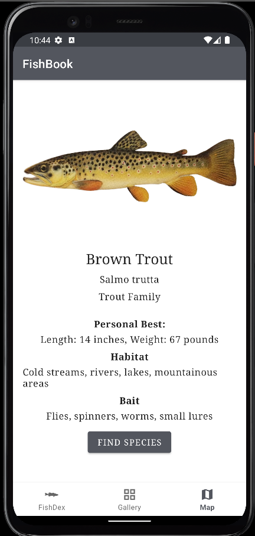

# Fishbook Android App Project

## Introduction

Fishbook is an app designed for Android users in Minnesota to capture and record their fishing catches. It was our final group project for the Android Software Development course at Gustavus Adolphus College. Inspired by the popular Nintendo franchise, Pokémon, our goal was to create a platform for users to document their fishing experiences in Minnesota. Throughout the project, we followed Agile Development with three two-week iterations and held daily SCRUM meetings with our professors to refine our work. Our target audience includes fishing and ice-fishing enthusiasts who want to create a gallery of their catches. The app is designed to evoke the spirit of Pokémon's motto, "Gotta catch them all." 

## Tools
* Android Studio
* FireBase
* XML
* Kotlin
* SQL
* Gradle

## Features
* Create Account/Login In Page
* Gallery Page
* Capture/Enter Detail/Pin Location Page
* Map
* FishDex Page
* Fish Species Detail Page

## Screenshots

## Installation

1. [Download and Install Android Studio](https://developer.android.com/studio?gad_source=1&gclid=Cj0KCQjwu-63BhC9ARIsAMMTLXQjYMhLUoUSalNTr17c68hzVxoTnGLIfLxJevMZb6A9mjwiCEuL3WQaAqDpEALw_wcB&gclsrc=aw.ds)
2. Download the zip file
3. Extract the zip file in the Downloads Folder
4. After installing Android Studio, open application and open file the extracted file
5. After open and loading the file, choose an android device either as an emulator or connect to your android phone
6. After setting up your device, then press run button to run the app